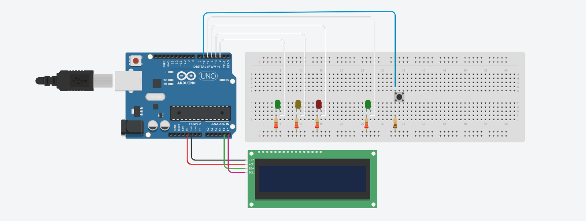

| | |
|-|-|
|`Author` | Ionescu Valentin-Gabriel

# Mini Feu de Signalisation Intelligent avec Arduino Uno

## Description

Ce projet simule un feu de signalisation intelligent à l'aide d'une carte Arduino Uno. Il automatise les cycles du feu tricolore pour les voitures (vert, jaune, rouge) et réagit lorsqu’un piéton appuie sur un bouton, arrêtant temporairement la circulation. Un écran LCD peut afficher des messages comme “Attendez...” ou “Traversez !”.

## Motivation

- **Apprentissage pratique de l’Arduino** : Parfait pour débuter avec les composants électroniques de base et la programmation.
- **Simulation réaliste** : Ce projet reproduit un feu de circulation tel qu’on le voit dans la vie réelle.
- **Interaction utilisateur** : Le bouton simule la demande d’un piéton, introduisant la gestion des événements.
- **Facile à étendre** : Il est possible d’ajouter d’autres éléments (capteurs, Wi-Fi, plus de LEDs) pour améliorer le système.

## Architecture

### 1. Entrée utilisateur
- **Bouton poussoir** : utilisé par le piéton pour demander à traverser. Il est relié à une broche numérique avec une résistance pull-down.

### 2. Sorties
- **LEDs pour voitures** : Rouge, Jaune, Verte – simulent le feu tricolore.
- **LED piéton** : Une LED verte s’allume lorsque les voitures sont arrêtées.
- **Écran LCD 1602 I2C** : Affiche des messages comme “Attendez...” ou “Traversez !”.

### 3. Logique de contrôle (Arduino)
- Gère un cycle normal du feu (vert → jaune → rouge).
- Quand le bouton est pressé, interrompt le cycle à la fin du vert :
  - Active le feu rouge voitures
  - Active LED piéton + LCD
  - Puis reprend le cycle normal

### 4. Alimentation
- L’Arduino est alimenté par USB.
- Il fournit l'alimentation aux LEDs, au bouton, et à l’écran.

## Composants

| Composant | Utilisation | Prix |
|--------|--------|-------|
| Arduino Uno R3 (câble USB inclus) | Microcontrôleur | [54.37 RON](https://www.optimusdigital.ro/ro/placi-avr/4561-placa-de-dezvoltare-compatibila-cu-arduino-uno-r3-atmega328p-atmega16u2-cablu-50-cm.html?search_query=arduino+uno&results=129) |
| Bouton 6x6x6 | Bouton pour les piétons | [0.36 RON](https://www.optimusdigital.ro/ro/butoane-i-comutatoare/1119-buton-6x6x6.html?search_query=buton&results=212) |
| LED rouge 5mm | Feux rouge pour les voitures | [0.39 RON](https://www.optimusdigital.ro/ro/optoelectronice-led-uri/29-led-set-3-culori-x-10-pcs-fiecare.html?search_query=led+rosu&results=166) |
| LED jaune 5mm | Feux jaune pour les voitures | [0.39 RON](https://www.optimusdigital.ro/ro/optoelectronice-led-uri/37-led-galben.html?search_query=led+galben&results=51) |
| LED vert 5mm | Feux verte pour les voitures et un autre pour les pietons | [0.78 RON (2 x 0.39)](https://www.optimusdigital.ro/ro/optoelectronice-led-uri/38-led-verde.html?search_query=led+verde&results=90) |
| Résistances 220Ω | Résistances pour les LED | [0.40 RON (4 x 0.10)](https://www.optimusdigital.ro/ro/componente-electronice-rezistoare/10958-rezistor-05w-220.html?search_query=rezistor+220&results=22) |
| Résistance 10KΩ | Résistance pour le bouton | [0.10 RON](https://www.optimusdigital.ro/ro/componente-electronice-rezistoare/1088-rezistor-025w-100k.html?search_query=rezistor+10k&results=13) |
| Écran LCD 16x2 avec interface I2C | Pour afficher si les piétons peuvent traverser ou pas | [14.99 RON](https://www.optimusdigital.ro/ro/optoelectronice-lcd-uri/62-lcd-1602-cu-interfata-i2c-si-backlight-galben-verde.html?search_query=lcd+i2c&results=17) |
| Breadbord 750 points | Pour la montage des composants | [8.98 RON](https://www.optimusdigital.ro/ro/prototipare-breadboard-uri/13245-breadboard-750-puncte.html?search_query=breadboard&results=126) |
| Fils mâle-mâle | Pour connecter les LED et le bouton | [4.99 RON](https://www.optimusdigital.ro/ro/fire-fire-mufate/884-set-fire-tata-tata-40p-10-cm.html?search_query=fir+tata+tata&results=111) |
| Fils femelle-mâle | Pour connecter l'écran LCD | [2.99 RON](https://www.optimusdigital.ro/ro/fire-fire-mufate/650-fire-colorate-mama-tata-10p.html?search_query=fire+tata+mama&results=35) |

## Schéma de câblage

## Libraries

| Library | Description | Usage |
|---------|-------------|-------|
|  | |  |
|  |  |  |

## Log

### Week 6 - 12 May

### Week 7 - 19 May

### Week 20 - 26 May

## Références
[Tutoriel YouTube](https://www.youtube.com/watch?v=PYgPImkcu-Q&ab_channel=Asali)

 
